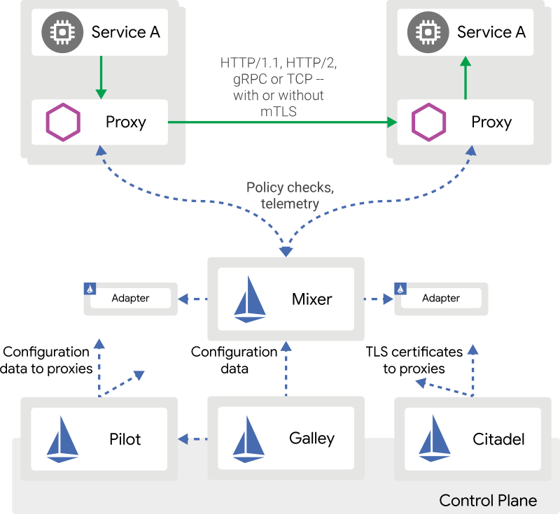
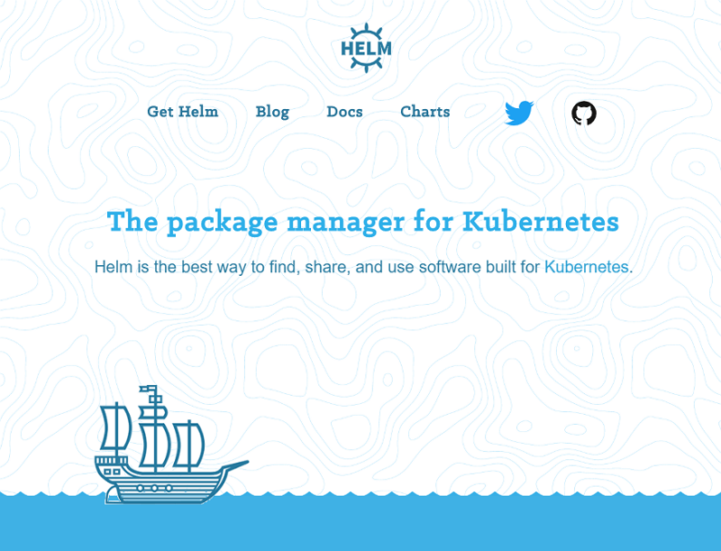
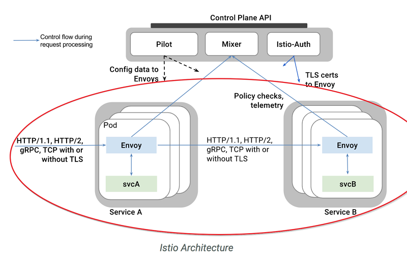
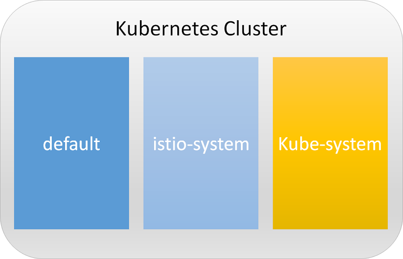

## Task 2 在GKE上部屬Istio
後續的功能演示需要部屬Istio，下列步驟將在K8S叢集中建立Istio的各項服務，並更改K8s部分原有架構，來達到對APP非侵入式控管與監控，中其中Istio架構如下：



我們將使用[Helm](https://helm.sh/ "Helm")來快速部屬Istio，Helm為K8s上常用的部屬工具



## 安裝Heml

```bash
wget https://storage.googleapis.com/kubernetes-helm/helm-v2.11.0-linux-amd64.tar.gz
```
```bash
tar xf helm-v2.11.0-linux-amd64.tar.gz
```
```bash
sudo cp linux-amd64/helm linux-amd64/tiller /usr/local/bin/
```
```bash
export PATH=$(pwd)/istio-$ISTIO_VERSION/bin:$(pwd)/linux-amd64/:$PATH
```
```bash
helm init --client-only
```

## 下載Istio 1.0.6
```bash
ISTIO_VERSION=1.0.6
```
```bash
echo "ISTIO_VERSION=1.0.6" | tee -a ~/.profile
```
```bash
wget https://github.com/istio/istio/releases/download/$ISTIO_VERSION/istio-$ISTIO_VERSION-linux.tar.gz
```
```bash
tar xvzf istio-$ISTIO_VERSION-linux.tar.gz
```

## 安裝Istio 1.0.6
```bash
echo "PATH=$(pwd)/GKE-Istio/istio-1.0.6/bin:$(pwd)/linux-amd64/:$PATH" | tee -a ~/.profile
```
```bash
kubectl create ns istio-system
```
```bash
helm template istio-$ISTIO_VERSION/install/kubernetes/helm/istio --name istio --namespace istio-system \
   --set kiali.enabled=true \
   --set global.mtls.enabled=false  > istio.yaml
```
## 新增kiali的 web Secret 帳/密: admin/admin
```bash
cat <<EOF | kubectl apply -f -
apiVersion: v1
kind: Secret
metadata:
  name: kiali
  namespace: istio-system
  labels:
    app: kiali
type: Opaque
data:
  username: YWRtaW4=
  passphrase: YWRtaW4=
EOF
```

```bash
kubectl apply -f istio.yaml
```

### 補充說明
Istio可針對安全性需求，將微服務之間通信設為強制 mutual TLS 版本(本workshop使用非強制設定)
若需使用強制 mutual TLS 版本，於產生istio.yaml範本時可增加下列設定來達成

```
helm template istio-1.0.6/install/kubernetes/helm/istio --name istio --namespace istio-system \
   ...
   --set global.mtls.enabled=true  > istio.yaml
   ...
```
在需執行下列指令，完成設定
```
kubectl apply -f istio-1.0.6/install/kubernetes/helm/istio/templates/crds.yaml
kubectl apply -f istio-1.0.6/install/kubernetes/helm/istio/charts/certmanager/templates/crds.yaml
```

## 驗證 Istio 安裝結果
3. 驗證 Istio 安裝在命名空間 istio-system 的結果
```bash
kubectl get svc -n istio-system
```
   應該看到類似的結果
```
NAME                     TYPE           CLUSTER-IP      EXTERNAL-IP      PORT(S)                                                AGE
istio-citadel            ClusterIP      10.43.243.141   <none>           8060/TCP,9093/TCP                                                28m
istio-egressgateway      ClusterIP      10.43.251.35    <none>           80/TCP,443/TCP                                                28m
istio-galley             ClusterIP      10.43.254.41    <none>           443/TCP,9093/TCP                                                28m
istio-ingressgateway     LoadBalancer   10.43.242.124   104.199.149.90   80:31380/TCP,443:31390/TCP,31400:31400/TCP,15011:31466/TCP,8060:32513/TCP,853:30560/TCP,15030:30148/TCP,15031:30169/TCP   28m
istio-pilot              ClusterIP      10.43.246.161   <none>           15010/TCP,15011/TCP,8080/TCP,9093/TCP                                                28m
istio-policy             ClusterIP      10.43.242.195   <none>           9091/TCP,15004/TCP,9093/TCP                                                28m
istio-sidecar-injector   ClusterIP      10.43.244.243   <none>           443/TCP                                                28m
istio-telemetry          ClusterIP      10.43.245.179   <none>           9091/TCP,15004/TCP,9093/TCP,42422/TCP                                                28m
kiali                    ClusterIP      10.43.250.63    <none>           20001/TCP                                                28m
prometheus               ClusterIP      10.43.249.167   <none>           9090/TCP                                                28m
```

## 驗證 Istio 安裝結果
4. 驗證 K8S Pods 已在運行
```bash
kubectl get pods -n istio-system
```
   請重複執行直到所有狀態都是Runing 或 Completed 
   應該看到類似的結果
```
NAME                                        READY   STATUS      RESTARTS   AGE
istio-citadel-555d845b65-xfdmj              1/1     Running     0          2d
istio-cleanup-secrets-8x2pl                 0/1     Completed   0          2d
istio-egressgateway-667d854c49-9q5dl        1/1     Running     0          2d
istio-galley-6c9cd5b8bb-4j4jk               1/1     Running     0          2d
istio-ingressgateway-6c796c5594-f972p       1/1     Running     0          2d
istio-pilot-77f74fc6f-rpbfj                 2/2     Running     0          2d
istio-policy-655b87fff-4wbwq                2/2     Running     0          2d
istio-security-post-install-tm2rm           0/1     Completed   1          2d
istio-sidecar-injector-668c9fb4db-p6lwt     1/1     Running     0          2d
istio-statsd-prom-bridge-5b645f6f4d-6pbgf   1/1     Running     0          2d
istio-telemetry-d9848f498-wf6kh             2/2     Running     0          2d
promsd-6b989699d8-l7jxt                 1/1     Running     0          2d
```

## 設定 Istio 使用範圍

將k8s的default namespace下的Pod，設為自動注入Sidecar，以加入Istio網格(service mesh)服務中

```bash
kubectl label namespace default istio-injection=enabled
```


而此workshop中k8s中會有3個namespaces

