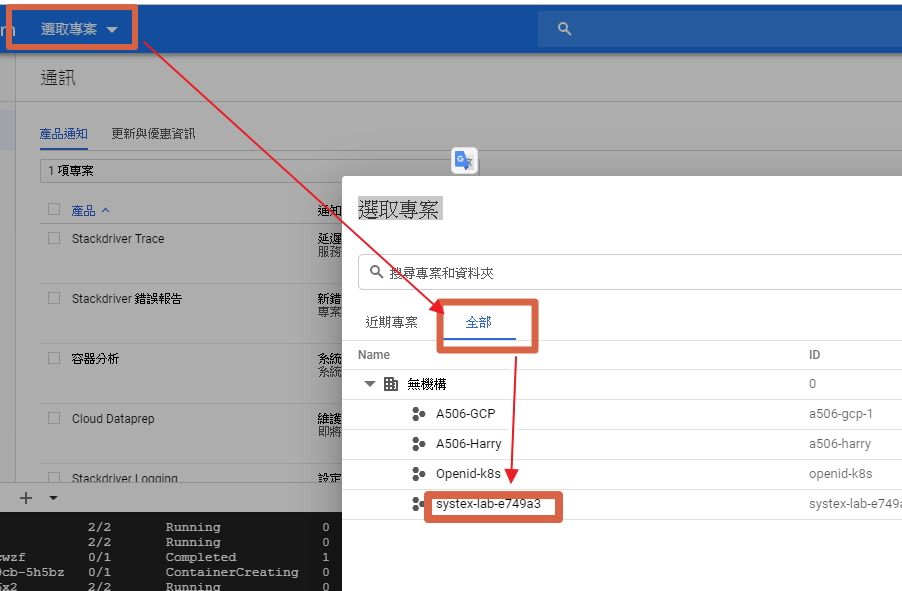
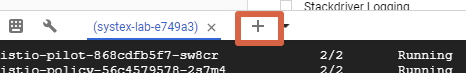
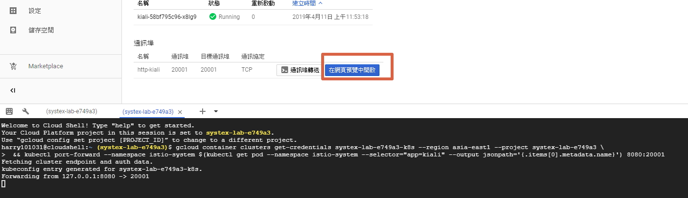
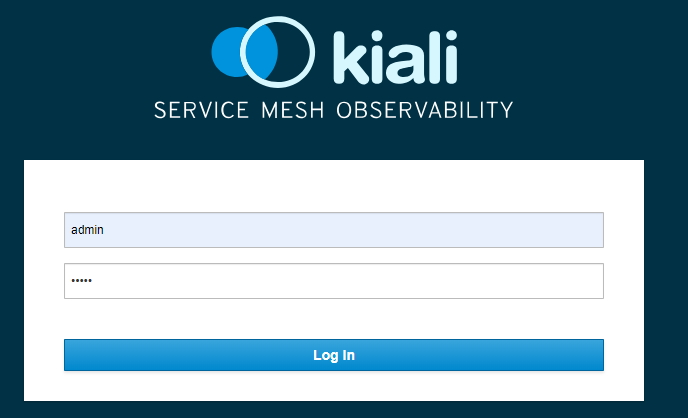
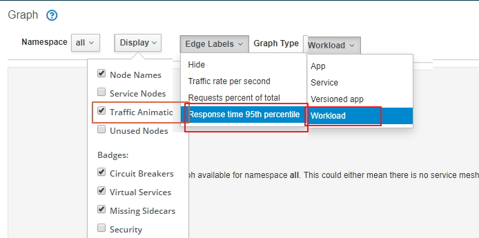

## kiali port-forword

開啟 kaili 工具的Graph 比對
### 注意: 請開啟新的cloud shell 將kiali的port-forword指令貼在新開啟的shell執行
請在跟CloudShell同一個brower開啟新分頁連線到GCP 網站上 Kubernetes Engine --> 服務 --> kiali (點選)--> 通訊埠轉送 (點選) 
注意此時請copy 指令碼在頁面右上方開啟新的cloudshell 貼上指令碼執行
--> 在網頁預覽中開啟

1. 

2. 

3. 

4. 

5. 

6. 

7. 

8. 
帳密: admin / admin

9. setting Graph

 
