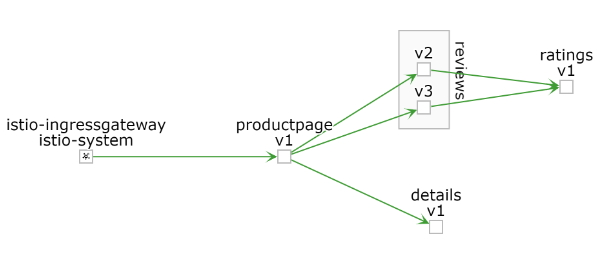

## Task 4 安裝 bookinfo 並簡易演示藍綠部屬
## 安裝 Istio 範例 bookinfo (1/3)
1. 確認在istio-1.0.6目錄下
```bash
mv istio-1.0.6 ~/GKE-Istio/
```
```bash
cd ~/GKE-Istio/istio-1.0.6
```
2. 設定 ISTIO_LAST 變數
```bash
echo "ISTIO_LAST=istio-1.0.6" | tee -a ~/.profile
```
3. 以下列指令打開設定檔 ~/GKE-Istio/bookinfo-only-have-veviews-v1.yaml。可以看到所有安裝的微服務版本都只有v1，後續將會增加佈署的版本。

```bash
less ~/GKE-Istio/bookinfo-only-have-veviews-v1.yaml
```


## 安裝 Istio 範例 bookinfo (2/3)

4. 安裝 bookinfo-only-have-veviews-v1.yaml
```bash
kubectl apply -f <(~/GKE-Istio/istio-1.0.6/bin/istioctl kube-inject -f ~/GKE-Istio/bookinfo-only-have-veviews-v1.yaml)
```
```bash
kubectl apply -f  ~/GKE-Istio/istio-1.0.6/samples/bookinfo/networking/bookinfo-gateway.yaml
```
5. 驗證 bookinfo 安裝
```bash
kubectl get services
```
   應該看到如下結果：
```
NAME                       CLUSTER-IP   EXTERNAL-IP   PORT(S)              AGE
details                    10.0.0.31    <none>        9080/TCP             6m
kubernetes                 10.0.0.1     <none>        443/TCP              7d
productpage                10.0.0.120   <none>        9080/TCP             6m
ratings                    10.0.0.15    <none>        9080/TCP             6m
reviews                    10.0.0.170   <none>        9080/TCP             6m
```
6. 更進一步驗證
```bash
kubectl get deployments,ing
```
   應該看到類似的結果
```
NAME                                   DESIRED   CURRENT   UP-TO-DATE   AVAILABLE   AGE
deployment.extensions/details-v1       1         1         1            1           6m
deployment.extensions/productpage-v1   1         1         1            1           6m
deployment.extensions/ratings-v1       1         1         1            1           6m
deployment.extensions/reviews-v1       1         1         1            1           6m
```
7. 驗證 K8S Pods 已在運行
```bash
kubectl get pods
```
   請重複執行直到所有狀態都是Runing 或 Completed 
   應該看到類似的結果
   
8. 取得bookinfo網址 http://$GATEWAY_URL/productpage 並驗證
```bash
INGRESSGATEWAY=istio-ingressgateway \
&& INGRESSGATEWAY_LABEL=istio
```
```bash
export INGRESS_IP=$(kubectl -n istio-system get service istio-ingressgateway  \
-o jsonpath='{.status.loadBalancer.ingress[0].ip}')
```
```bash
echo "INGRESS_IP=$INGRESS_IP" | tee -a ~/.profile
```
```bash
echo http://$INGRESS_IP/productpage
```

9. kaili 畫面


## 安裝 Istio 範例 bookinfo (3/3)


##  bookinfo 藍綠部屬 (1/2)
1. 佈屬bookinfo含有bookinfo veviews-v1, veviews-v2 和veviews-v3
```bash
kubectl apply -f <(~/GKE-Istio/istio-1.0.6/bin/istioctl kube-inject -f  ~/GKE-Istio/istio-1.0.6/samples/bookinfo/platform/kube/bookinfo.yaml)
```
2. 驗證 是否新增新的微服務
```bash
kubectl get deployments,ing
```
3. 應該看到類似的結果
```
NAME                                   DESIRED   CURRENT   UP-TO-DATE   AVAILABLE   AGE
deployment.extensions/details-v1       1         1         1            1           42m
deployment.extensions/productpage-v1   1         1         1            1           42m
deployment.extensions/ratings-v1       1         1         1            1           42m
deployment.extensions/reviews-v1       1         1         1            1           42m
deployment.extensions/reviews-v2       1         1         1            1           2m
deployment.extensions/reviews-v3       1         1         1            1           2m
```
4. 驗證 K8S Pods 已在運行
```bash
kubectl get pods
```
   請重複執行直到所有狀態都是Runing 或 Completed 
   應該看到類似的結果
```bash
kubectl get po
```
```bash
NAME                              READY     STATUS        RESTARTS   AGE
details-v1-75754887d9-rdbrx       2/2       Running       0          5m
productpage-v1-7b96bbf89f-jssgp   2/2       Running       0          5m
ratings-v1-5b89496689-bgwkq       2/2       Running       0          5m
reviews-v1-5fb6b66dfb-wwfw8       2/2       Running       0          5m
reviews-v2-ff6679549-vx5qc        2/2       Running       0          5m
reviews-v3-67499898bb-j9xcw       2/2       Running       0          5m
```
   
5. 驗證 會看到有三個不同的星星顯示方式
```bash
echo http://$INGRESS_IP/productpage
```
6. kaili 畫面


##  bookinfo 藍綠部屬 (2/2)
### 假設V1版本出問題
7. 將疑似有問題的v1版本下線
```bash
kubectl delete -f <(~/GKE-Istio/istio-1.0.6/bin/istioctl kube-inject -f  ~/GKE-Istio/reviews-v1.yaml)
```
會看到v1 狀態為 如下Terminating
```bash
kubectl get po
```
```bash
NAME                              READY     STATUS        RESTARTS   AGE
details-v1-75754887d9-rdbrx       2/2       Running       0          5m
productpage-v1-7b96bbf89f-jssgp   2/2       Running       0          5m
ratings-v1-5b89496689-bgwkq       2/2       Running       0          5m
reviews-v1-5fb6b66dfb-wwfw8       2/2       Terminating   0          5m
reviews-v2-ff6679549-vx5qc        2/2       Running       0          5m
reviews-v3-67499898bb-j9xcw       2/2       Running       0          5m
```
8. 驗證 沒有星號的V1 版本消失了
```bash
echo http://$INGRESS_IP/productpage
```
9. kaili 畫面


