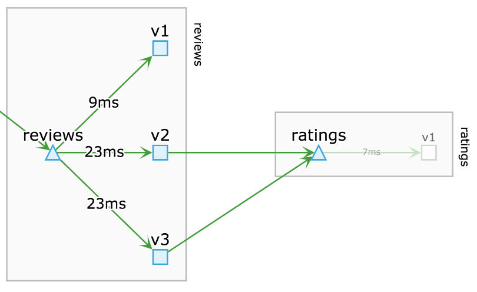
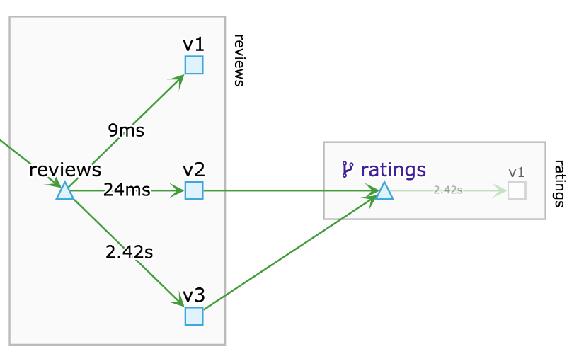
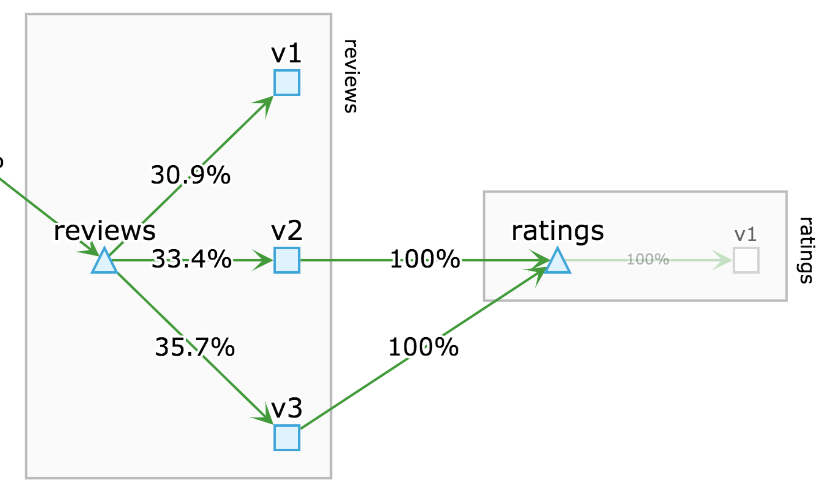

# 在 Google Cloud Shell 上建置 Istio 


## 新增 or 選擇 GCP 專案

底下請選擇執行作業的專案{{project-id}}。
<walkthrough-project-billing-setup></walkthrough-project-billing-setup>

## 設定專案 ID
1. 將專案ID及名稱存為環境參數。
```bash
export PROJECT_ID={{project-id}}; export PROJECT_NAME={{project-name}}
```
2. 將 Cloud Shell 連接至專案
```bash
gcloud config set project {{project-id}}
```
3. 設定預設的 region (建議為 asia-east1  ,台灣 彰濱)
```bash
gcloud config set compute/region asia-east1
```
4. 至下列網址啟用專案的 Kubernetes Engin API  
```bash
gcloud services enable container.googleapis.com
```
或是至Web page [啟用 Kubernetes Engin API](https://console.cloud.google.com/apis/library/container.googleapis.com?q=kubernetes%20engine&amp;_ga=2.82276438.-1912799670.1549085300)

## 安裝 Google 準備的 K8S 叢集
請上網查看[相容的K8S版本](https://cloud.google.com/istio/docs/istio-on-gke/installing#supported_gke_cluster_versions)
設定到底下的 cluster name, and [cluster-version]。  

### 安裝GKE 此步驟需要等一段時間完成
```bash
gcloud beta container clusters create {{project-id}}-k8s \
    --project=$PROJECT_ID \
    --machine-type=n1-standard-2 \
    --region=asia-east1 \
    --num-nodes=1 
```

新增 namespaces
```bash
kubectl create ns istio-system
```

## 授權使用者權限為 GKE的cluster-admin 
```bash
kubectl create clusterrolebinding cluster-admin-binding --clusterrole=cluster-admin --user=$(gcloud config get-value core/account)
```

## 安裝 Istio 1.05
下載 Istio 1.05 並安裝helm, 請複製貼到command上
```
export ISTIO_VERSION=1.0.5
wget https://github.com/istio/istio/releases/download/$ISTIO_VERSION/istio-$ISTIO_VERSION-linux.tar.gz
tar xvzf istio-$ISTIO_VERSION-linux.tar.gz

wget https://storage.googleapis.com/kubernetes-helm/helm-v2.11.0-linux-amd64.tar.gz
tar xf helm-v2.11.0-linux-amd64.tar.gz

export PATH=`pwd`/istio-$ISTIO_VERSION/bin:`pwd`/linux-amd64/:$PATH

kubectl apply -f istio-$ISTIO_VERSION/install/kubernetes/helm/istio/templates/crds.yaml
kubectl apply -f istio-$ISTIO_VERSION/install/kubernetes/helm/istio/charts/certmanager/templates/crds.yaml

helm init --client-only
```

底下兩種安裝選項，關係到 istio 的微服務是否只限於 TLS 加密通訊。為了workshop順利建議選擇第一項，事後可以修改。
1. 不強制 mutual TLS 版本  請複製貼到command上
```
helm template istio-$ISTIO_VERSION/install/kubernetes/helm/istio --name istio --namespace istio-system \
   --set servicegraph.enabled=true \
   --set tracing.enabled=true \
   --set sidecarInjectorWebhook.enabled=true \
   --set gateways.istio-ilbgateway.enabled=true \
   --set kiali.enabled=true \
   --set global.mtls.enabled=false  > istio.yaml
kubectl apply -f istio.yaml
```
2. 強制 mutual TLS 版本 參考
```
helm template istio-$ISTIO_VERSION/install/kubernetes/helm/istio --name istio --namespace istio-system \
   --set servicegraph.enabled=true \
   --set tracing.enabled=true \
   --set sidecarInjectorWebhook.enabled=true \
   --set gateways.istio-ilbgateway.enabled=true \
   --set kiali.enabled=true \
   --set global.mtls.enabled=true  > istio.yaml
kubectl apply -f istio.yaml
```

## 驗證 Istio 安裝結果
1. 查看 K8S 叢集
```bash
gcloud container clusters list
```
2. 取得 K8S 叢集認證
```bash
gcloud container clusters get-credentials {{project-id}}-k8s --region=asia-east1
````

3. 驗證 Istio 安裝在命名空間 istio-system 的結果
```bash
kubectl get svc -n istio-system
```
   應該看到類似的結果
```
NAME                       TYPE           CLUSTER-IP      EXTERNAL-IP   PORT(S)                                                                                                                   AGE
istio-citadel              ClusterIP      10.47.245.92    <none>        8060/TCP,9093/TCP                                                                                                         12s
istio-egressgateway        ClusterIP      10.47.248.129   <none>        80/TCP,443/TCP                                                                                                            12s
istio-galley               ClusterIP      10.47.248.109   <none>        443/TCP,9093/TCP                                                                                                          12s
istio-ingressgateway       LoadBalancer   10.47.248.117   <pending>     80:31380/TCP,443:31390/TCP,31400:31400/TCP,15011:30221/TCP,8060:32445/TCP,853:30663/TCP,15030:32010/TCP,15031:32633/TCP   12s
istio-pilot                ClusterIP      10.47.251.133   <none>        15010/TCP,15011/TCP,8080/TCP,9093/TCP                                                                                     12s
istio-policy               ClusterIP      10.47.255.244   <none>        9091/TCP,15004/TCP,9093/TCP                                                                                               12s
istio-sidecar-injector     ClusterIP      10.47.240.36    <none>        443/TCP                                                                                                                   12s
istio-statsd-prom-bridge   ClusterIP      10.47.247.135   <none>        9102/TCP,9125/UDP                                                                                                         12s
istio-telemetry            ClusterIP      10.47.242.73    <none>        9091/TCP,15004/TCP,9093/TCP,42422/TCP                                                                                     12s
promsd                     ClusterIP      10.47.241.188   <none>        9090/TCP                                          
```

4. 驗證 K8S Pods 已在運行
```bash
kubectl get pods -n istio-system
```
   應該看到類似的結果
```
NAME                                        READY   STATUS      RESTARTS   AGE
istio-citadel-555d845b65-xfdmj              1/1     Running     0          2d
istio-cleanup-secrets-8x2pl                 0/1     Completed   0          2d
istio-egressgateway-667d854c49-9q5dl        1/1     Running     0          2d
istio-galley-6c9cd5b8bb-4j4jk               1/1     Running     0          2d
istio-ingressgateway-6c796c5594-f972p       1/1     Running     0          2d
istio-pilot-77f74fc6f-rpbfj                 2/2     Running     0          2d
istio-policy-655b87fff-4wbwq                2/2     Running     0          2d
istio-security-post-install-tm2rm           0/1     Completed   1          2d
istio-sidecar-injector-668c9fb4db-p6lwt     1/1     Running     0          2d
istio-statsd-prom-bridge-5b645f6f4d-6pbgf   1/1     Running     0          2d
istio-telemetry-d9848f498-wf6kh             2/2     Running     0          2d
promsd-6b989699d8-l7jxt                 1/1     Running     0          2d
```

## 設定 Istio 使用範圍
在範例 bookinfo 的 namespace <預設為dafault,您也可以自訂> 啟用 sidecar injection
```bash
kubectl label namespace default istio-injection=enabled
```

## 安裝 Istio 範例 bookinfo (1/3)
1. 設定 istio1.05 版本之參數
```bash
export ISTIO_LAST=istio-$ISTIO_VERSION
```
2. 設定 istioctl 路徑
```bash
export PATH="$PATH:~/$ISTIO_LAST/bin" ; cd $ISTIO_LAST
```
3. 觀看說明 ../bookinfo-only-have-veviews-v1.yaml，內容中的 default 可置換成自訂的 namespace 名稱。
```
apiVersion: v1
kind: Namespace
metadata:
  name: default
---
##################################################################################################
# Details service
##################################################################################################
apiVersion: v1
kind: Service
metadata:
  name: details
  namespace: default
  labels:
    app: details
spec:
  ports:
  - port: 9080
    name: http
  selector:
    app: details
---
apiVersion: extensions/v1beta1
kind: Deployment
metadata:
  name: details-v1
  namespace: default
spec:
  replicas: 1
  template:
    metadata:
      labels:
        app: details
        version: v1
    spec:
      containers:
      - name: details
        image: istio/examples-bookinfo-details-v1:1.10.1
        imagePullPolicy: IfNotPresent
        ports:
        - containerPort: 9080
---
##################################################################################################
# Ratings service
##################################################################################################
apiVersion: v1
kind: Service
metadata:
  name: ratings
  namespace: default
  labels:
    app: ratings
spec:
  ports:
  - port: 9080
    name: http
  selector:
    app: ratings
---
apiVersion: extensions/v1beta1
kind: Deployment
metadata:
  name: ratings-v1
  namespace: default
spec:
  replicas: 1
  template:
    metadata:
      labels:
        app: ratings
        version: v1
    spec:
      containers:
      - name: ratings
        image: istio/examples-bookinfo-ratings-v1:1.10.1
        imagePullPolicy: IfNotPresent
        ports:
        - containerPort: 9080
---
##################################################################################################
# Reviews service
##################################################################################################
apiVersion: v1
kind: Service
metadata:
  name: reviews
  namespace: default
  labels:
    app: reviews
spec:
  ports:
  - port: 9080
    name: http
  selector:
    app: reviews
---
apiVersion: extensions/v1beta1
kind: Deployment
metadata:
  name: reviews-v1
  namespace: default
spec:
  replicas: 1
  template:
    metadata:
      labels:
        app: reviews
        version: v1
    spec:
      containers:
      - name: reviews
        image: istio/examples-bookinfo-reviews-v1:1.10.1
        imagePullPolicy: IfNotPresent
        ports:
        - containerPort: 9080
---
##################################################################################################
# Productpage services
##################################################################################################
apiVersion: v1
kind: Service
metadata:
  name: productpage
  namespace: default
  labels:
    app: productpage
spec:
  ports:
  - port: 9080
    name: http
  selector:
    app: productpage
---
apiVersion: extensions/v1beta1
kind: Deployment
metadata:
  name: productpage-v1
  namespace: default
spec:
  replicas: 1
  template:
    metadata:
      labels:
        app: productpage
        version: v1
    spec:
      containers:
      - name: productpage
        image: istio/examples-bookinfo-productpage-v1:1.10.1
        imagePullPolicy: IfNotPresent
        ports:
        - containerPort: 9080
---

```

## 安裝 Istio 範例 bookinfo (2/3)

4. 安裝 bookinfo-only-have-veviews-v1.yaml
```bash
kubectl apply -f <(istioctl kube-inject -f ../bookinfo-only-have-veviews-v1.yaml)
```
```bash
kubectl apply -f  samples/bookinfo/networking/bookinfo-gateway.yaml
```
5. 驗證 bookinfo 安裝
```bash
kubectl get services
```
   應該看到如下結果：
```
NAME                       CLUSTER-IP   EXTERNAL-IP   PORT(S)              AGE
details                    10.0.0.31    <none>        9080/TCP             6m
kubernetes                 10.0.0.1     <none>        443/TCP              7d
productpage                10.0.0.120   <none>        9080/TCP             6m
ratings                    10.0.0.15    <none>        9080/TCP             6m
reviews                    10.0.0.170   <none>        9080/TCP             6m
```
6. 更進一步驗證
```bash
kubectl get deployments,ing
```
   應該看到類似的結果
```
NAME                                   DESIRED   CURRENT   UP-TO-DATE   AVAILABLE   AGE
deployment.extensions/details-v1       1         1         1            1           6m
deployment.extensions/productpage-v1   1         1         1            1           6m
deployment.extensions/ratings-v1       1         1         1            1           6m
deployment.extensions/reviews-v1       1         1         1            1           6m
```
7. 取得bookinfo網址 http://$GATEWAY_URL/productpage 並驗證
```bash
INGRESSGATEWAY=istio-ingressgateway \
&& INGRESSGATEWAY_LABEL=istio
```
```bash
export INGRESS_IP=$(kubectl -n istio-system get service istio-ingressgateway  \
-o jsonpath='{.status.loadBalancer.ingress[0].ip}')
```
```bash
echo http://$INGRESS_IP/productpage
```

## 安裝 Istio 範例 bookinfo (3/3)

開啟 kaili 工具的Graph 比對

請在跟CloudShell同一個brower開啟新分頁連線到GCP 網站上 Kubernetes Engine --> 服務 --> kiali (點選)--> 通訊埠轉送 (點選) 
注意此時請copy 指令碼在頁面右上方開啟新的cloudshell 貼上指令碼執行
--> 在網頁預覽中開啟


帳密: admin / admin

Graph


##  bookinfo 藍綠部屬
1. 佈屬bookinfo含有bookinfo veviews-v1, veviews-v2 和veviews-v3
```bash
kubectl apply -f <(istioctl kube-inject -f  ~/$ISTIO_LAST/samples/bookinfo/platform/kube/bookinfo.yaml)
```
2. 驗證 是否新增新的微服務
```bash
kubectl get deployments,ing
```
3. 應該看到類似的結果
```
NAME                                   DESIRED   CURRENT   UP-TO-DATE   AVAILABLE   AGE
deployment.extensions/details-v1       1         1         1            1           42m
deployment.extensions/productpage-v1   1         1         1            1           42m
deployment.extensions/ratings-v1       1         1         1            1           42m
deployment.extensions/reviews-v1       1         1         1            1           42m
deployment.extensions/reviews-v2       1         1         1            1           2m
deployment.extensions/reviews-v3       1         1         1            1           2m
```

4. 驗證 會看到有三個不同的星星顯示方式
```bash
echo http://$INGRESS_IP/productpage
```
5. kaili 畫面


##  bookinfo 延遲故障注入(Delay Injection) (1/4)

延遲故障注入，可以模擬當網路出現延遲時，微服務的運作是否正常

本段將模擬 reviews v3 到 ratings v1 的過程中出現網路延遲，健康的 bookinfo 服務時間如下圖



##  bookinfo 延遲故障注入(Delay Injection) (2/4)
預設rule

```bash
kubectl apply -f samples/bookinfo/networking/destination-rule-all.yaml
```

執行以下指令，將注入 1秒的延遲

```bash
kubectl apply -f ../fault-inject-delay.yaml
```

設定細節說明
```
* __spec.http.fault.delay.fixedDelay__ : 注入延遲的時間
* __spec.http.fault.delay.percent__ : 注入錯誤的流量百分比 (0 ~ 100)
* __spec.http.match.sourceLabels.version__ : 流量來源的版號

apiVersion: networking.istio.io/v1alpha3
kind: VirtualService
metadata:
  name: ratings
spec:
  hosts:
  - ratings
  http:
  - fault:
      delay:
        fixedDelay: 1s
        percent: 100
    match:
    - sourceLabels:
        version: v3
    route:
    - destination:
        host: ratings
        subset: v1
  - route:
    - destination:
        host: ratings
        subset: v1
```

##  bookinfo 延遲故障注入(Delay Injection) (3/4)

延遲故障注入後，可以明顯看到，通過 `reviews v3` 的流量，回應時間明顯增加，如下圖



##  bookinfo 延遲故障注入 (Delay Injection)(4/4)

接著要展示， __中斷故障注入__ ，在開始之前，請執行以下指令，取消原本注入的錯誤

```bash
kubectl delete -f ../fault-inject-delay.yaml
```

##  bookinfo 中斷故障注入(Fault Injection) (1/4)

中斷故障注入，可以模擬當其它服務異常時，微服務的運作是否正常

本段將模擬 reviews v3 到 ratings v1 的過程中出現中斷異常，健康的 bookinfo 服務時間如下圖



##  bookinfo 延遲故障注入(Fault Injection) (2/4)

執行以下指令，將注入 1秒的延遲

```bash
kubectl apply -f ../fault-inject.yaml
```

設定細節說明
```
* __spec.http.fault.delay.fixedDelay__ : 注入延遲的時間
* __spec.http.fault.delay.percent__ : 注入錯誤的流量百分比 (0 ~ 100)
* __spec.http.match.sourceLabels.version__ : 流量來源的版號
```

```
apiVersion: networking.istio.io/v1alpha3
kind: VirtualService
metadata:
  name: ratings
spec:
  hosts:
  - ratings
  http:
  - fault:
      abort:
        httpStatus: 500
        percent: 100
    match:
    - sourceLabels:
        version: v3
    route:
    - destination:
        host: ratings
        subset: v1
  - route:
    - destination:
        host: ratings
        subset: v1
```

##  bookinfo 中斷故障注入(Fault Injection) (3/4)

中斷故障注入後，可以明顯看到， `reviews v3` 往 `ratings v1` 的流量，全部都收到 `http: 500` 的中斷


##  bookinfo 中斷故障注入(Fault Injection) (4/4)

Cleanup

```bash
kubectl delete -f ../fault-inject.yaml
```
